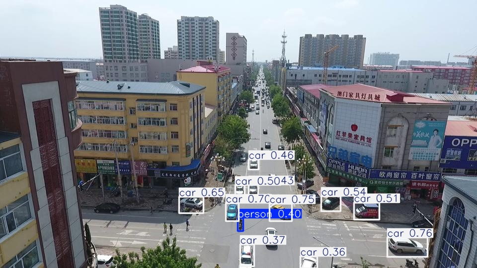
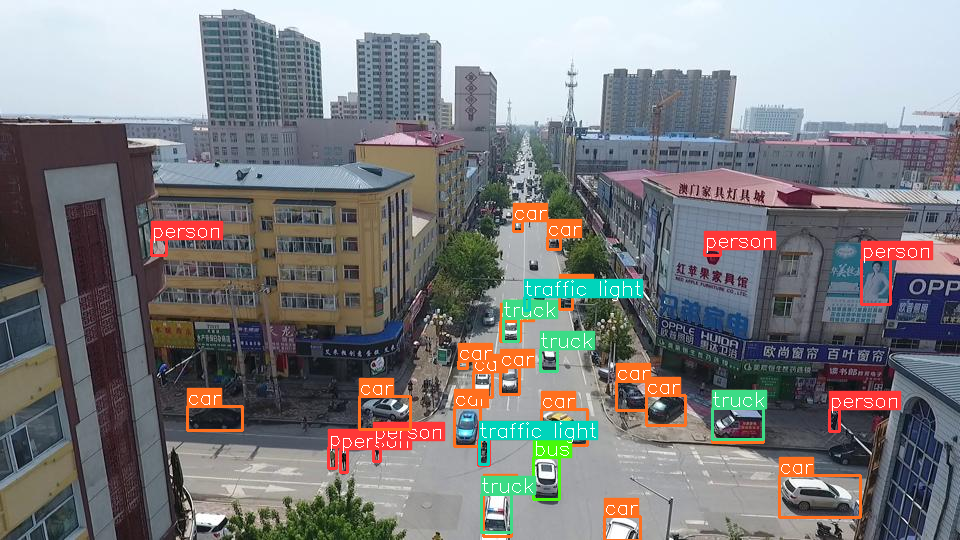
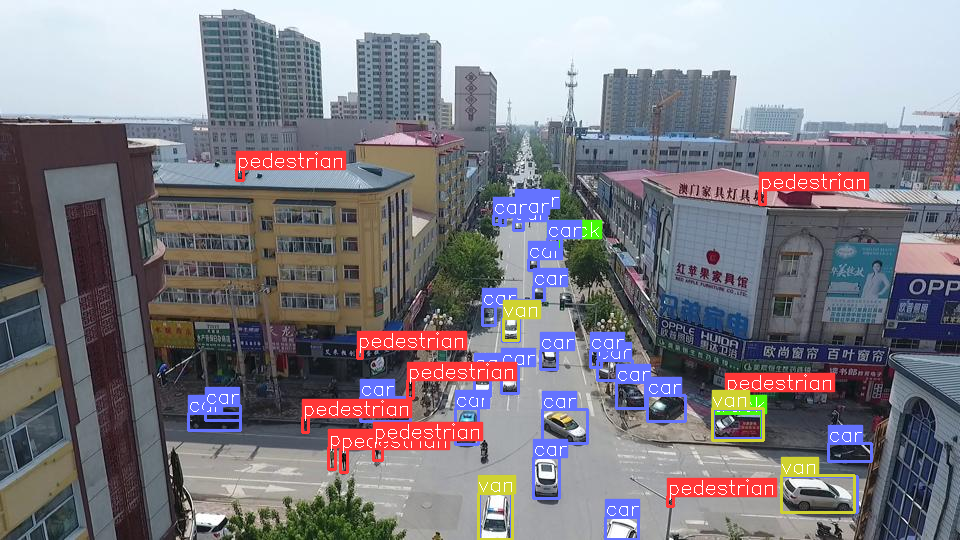

# YOLO + SAHI on VisDrone — Small Object Detection from Drone Imagery

> **The problem isn't always the model — sometimes it's how you feed it the image.**

Exploring small object detection on aerial drone imagery using YOLOv8 + SAHI (Slicing Aided Hyper Inference) on the VisDrone dataset.

---

## The Problem

Standard YOLOv8 struggles with small objects in aerial imagery. When a full drone image is resized to 640×640, small objects (pedestrians, motorcycles, bicycles) shrink to just 3–4 pixels — not enough features for the model to learn from.

---

## The Solution — SAHI

Instead of feeding the full compressed image, SAHI slices it into smaller overlapping patches and runs inference on each one separately. This preserves the original resolution of small objects and significantly improves recall.

---

## Experiments

### 1. Standard YOLOv8 (no fine-tuning, no SAHI)
- Detects large objects (cars) reasonably well
- Misses most small objects entirely



### 2. YOLOv8 + SAHI
- Significant improvement in recall
- More classes detected (pedestrians, motorcycles, vans)
- Issue: duplicate detections (False Positives) due to overlapping slices → solved with NMS post-processing



### 3. Fine-tuned YOLOv8 on VisDrone + SAHI ✅
- Best results overall
- Model trained on aerial-specific data
- Better class distinction across all 10 VisDrone categories



---

## Results Summary

| Approach | Small Objects | Classes | False Positives |
|---|---|---|---|
| YOLOv8 standard | ❌ mostly missed | cars only | low |
| YOLOv8 + SAHI | ✅ improved | more classes | high |
| Fine-tuned + SAHI | ✅ best | all classes | reduced |

**Fine-tuned mAP@0.5:** `0.200` (subset of 500 images, 20 epochs)

---

## Dataset

[VisDrone2019](https://github.com/VisDrone/VisDrone-Dataset) — 10 classes:
`pedestrian, people, bicycle, car, van, truck, tricycle, awning-tricycle, bus, motor`

---

## Getting Started

```bash
pip install ultralytics sahi
```

```python
# Run SAHI inference with fine-tuned model
from sahi import AutoDetectionModel
from sahi.predict import get_sliced_prediction

detection_model = AutoDetectionModel.from_pretrained(
    model_type="yolov8",
    model_path="best.pt",
    confidence_threshold=0.3,
    device="cuda"
)

result = get_sliced_prediction(
    "image.jpg",
    detection_model,
    slice_height=256,
    slice_width=256,
    overlap_height_ratio=0.2,
    overlap_width_ratio=0.2,
    postprocess_type="NMS",
    postprocess_match_threshold=0.5,
)

result.export_visuals(export_dir="output")
```

---

## Key Takeaway

> SAHI doesn't make the model smarter — it gives it a better view of the data.
> Combined with domain-specific fine-tuning, it's a practical solution for real-world drone perception challenges.

---

## References

- [SAHI Paper — arxiv.org/abs/2202.06934](https://arxiv.org/abs/2202.06934)
- [VisDrone Dataset](https://github.com/VisDrone/VisDrone-Dataset)
- [Ultralytics YOLOv8](https://docs.ultralytics.com)
- [SAHI GitHub](https://github.com/obss/sahi)

---

## Note

Training was done on a subset (500 train / 100 val images) on an RTX 3060 Laptop (6GB VRAM).
Full dataset training would yield significantly better results.
